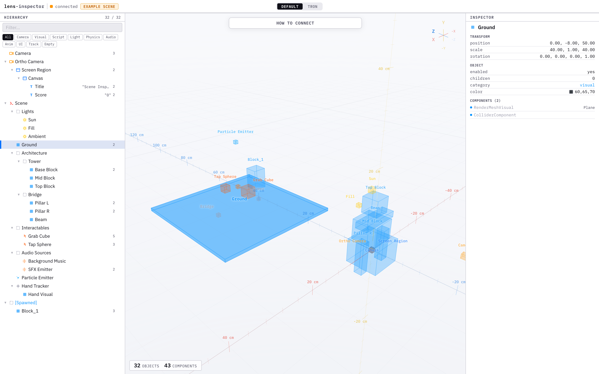
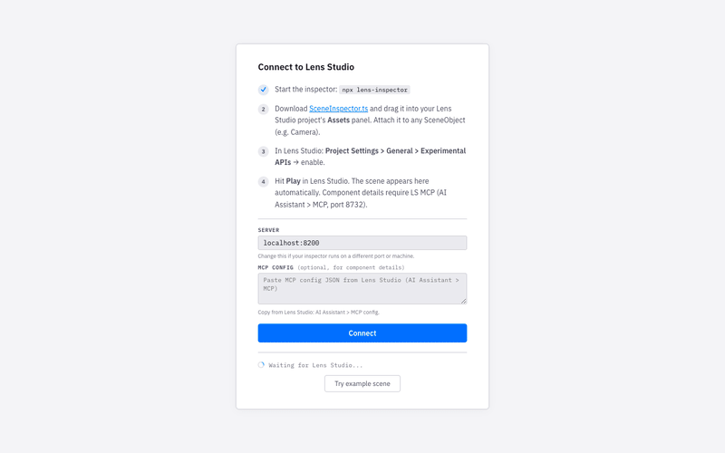
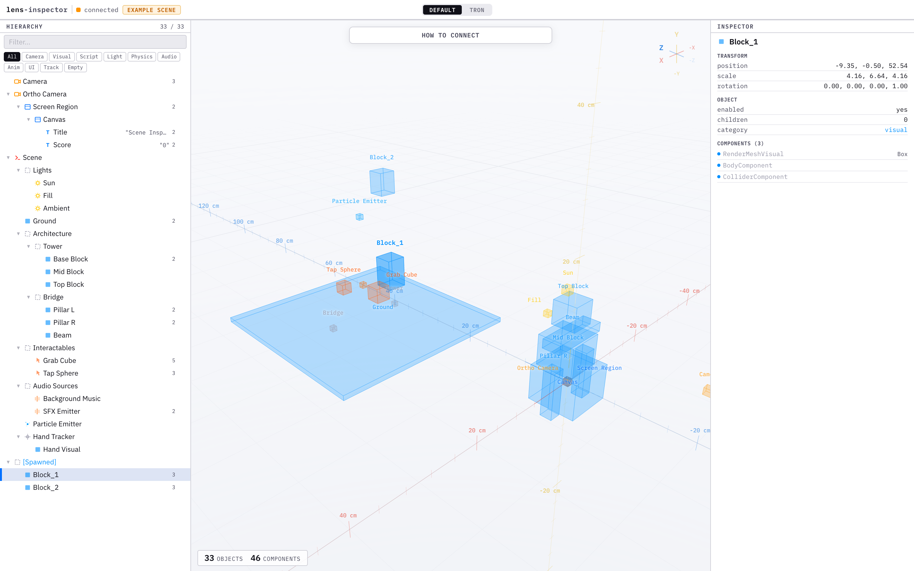
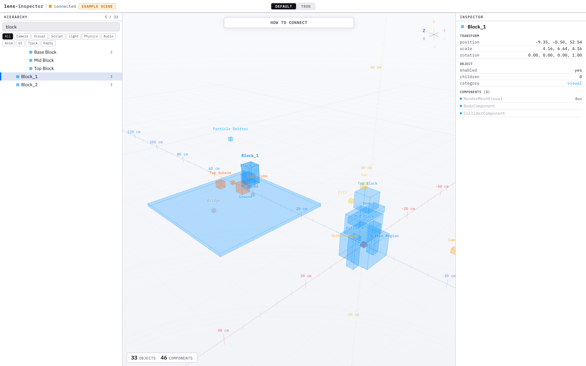
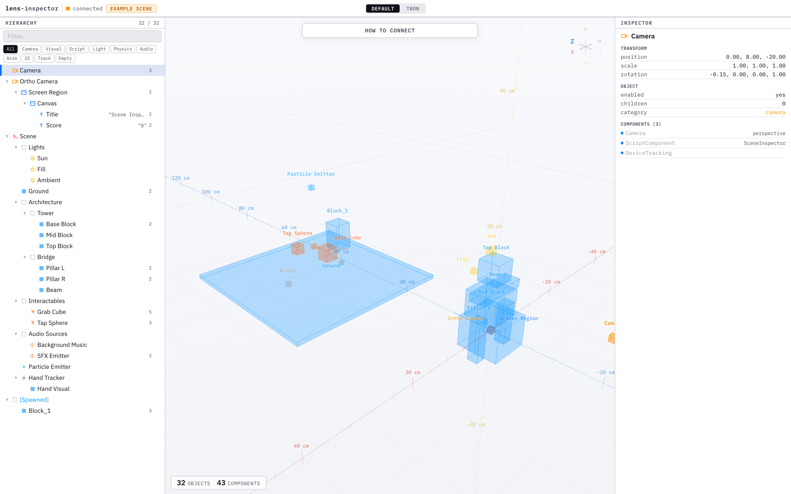
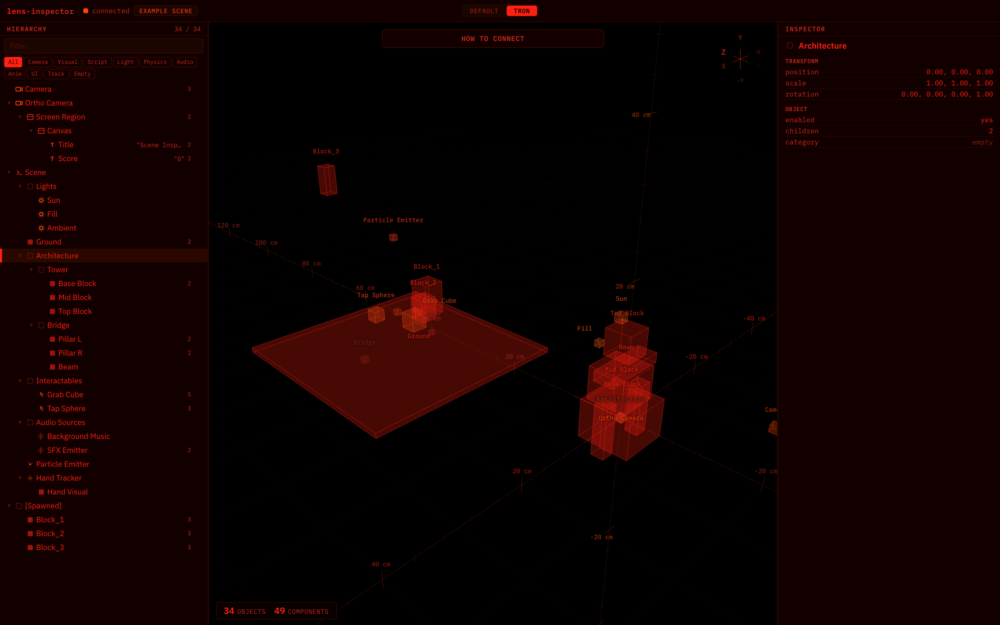
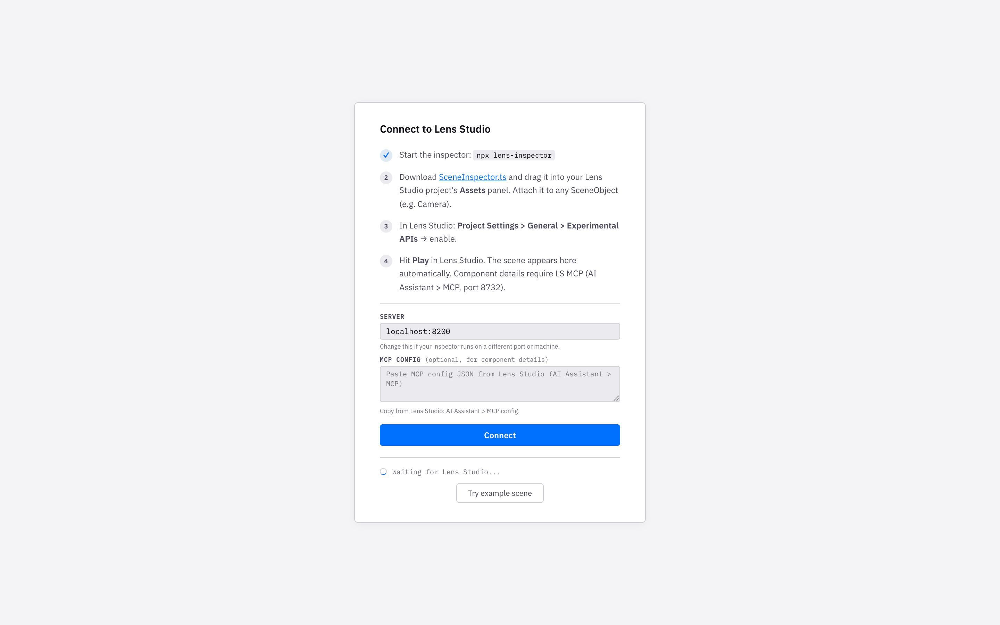

# scene-inspector

A scene graph inspector for [Lens Studio](https://developers.snap.com/lens-studio) that embeds directly in the editor as a dockable panel, showing every object in your scene including the ones created at runtime by scripts that never appear in the Scene Hierarchy.



## Install

In Lens Studio, go to **Window > Asset Library > Plugin** and search for **Scene Inspector**. The plugin installs with one click and appears as a dockable panel in the editor.

### Manual install

If you prefer to install from source:

1. Clone this repo or [download the ZIP](https://github.com/a-sumo/scene-inspector/archive/refs/heads/main.zip)
2. In Lens Studio, go to **Preferences > Plugins**, click **+ Add New Location**, and select the `scene-inspector` folder
3. Enable **Scene Inspector** in the plugin list

The inspector panel will show your scene hierarchy, a 3D viewport, and component details for whatever node you select.

## Demo project

The included `LSProject/` folder has everything pre-configured, so you can open it in Lens Studio and hit Play to see runtime-spawned blocks appear live in the inspector.



## Runtime objects

By default the plugin reads the scene through the Editor API, which covers everything in the Scene Hierarchy, but objects created at runtime by scripts (`instantiatePrefab`, `createSceneObject`, `MeshBuilder`) only exist in the lens runtime and aren't visible to it.

To see those objects:

1. Find `SceneInspector.ts` in the Scene Inspector plugin folder (or in this repo's `plugin/` directory) and drag it into your project's Asset Browser
2. Attach the SceneInspector component to any SceneObject (e.g. Camera)
3. In Lens Studio, go to **Project Settings > General** and enable **Experimental APIs**
4. Hit Play

The plugin auto-detects the runtime connection and switches from editor-mode to live-mode, falling back to the editor graph when you stop preview. Click the **?** button in the panel toolbar to see these steps from inside the plugin.



## Features

### 3D Viewport

Every SceneObject renders as a labeled wireframe box that you can orbit with left-click drag, pan with middle-click or right-click, and zoom with scroll. WASD/QE lets you fly through the scene (hold Shift for speed), and navigation keys use physical key positions so they work on AZERTY, QWERTZ, and other layouts.

### Hierarchy Panel

The left panel shows a collapsible tree matching your scene structure, with each node displaying a color-coded icon by component category and a component count badge.

- **Search**: filters by name, text content, component type, or category
- **Category chips**: narrow the tree to Camera, Visual, Script, Light, Physics, Audio, Anim, UI, Track, or Empty
- **Eye toggle**: the eye icon on hover hides or shows individual nodes in the 3D viewport



### Inspector Panel

Selecting any node in the tree or 3D viewport shows its transform, object properties, color, text content, and a full component list with type-specific details like mesh name, material, script asset, camera FOV, audio track, and physics mass.



### Component Detection

The runtime walker probes 40+ known Lens Studio component types individually, so when the generic `getComponentCount("Component")` returns 0 in certain LS versions the fallback catches what would otherwise show as empty nodes.

### Tron Theme

A dark red-on-black theme with a built-in soundtrack, toggled via the segmented control in the toolbar.



## Browser mode

If you prefer a standalone browser viewer (useful for a larger screen or for development), you can run the inspector as a local server instead of using the plugin. This requires [Node.js](https://nodejs.org/).

```bash
npx scene-inspector
```

Or clone and run directly:

```bash
npm install
node server.js
```

The server starts on port 8200 and opens the viewer in your browser, where the on-screen setup steps walk you through connecting Lens Studio.



### MCP integration

For additional component detail in browser mode, the viewer can proxy MCP calls through the inspector server to avoid CORS. The MCP config JSON is available from **AI Assistant > MCP** in Lens Studio and goes into the setup panel (click "How to connect" in the viewport).

```bash
npx scene-inspector --mcp http://localhost:8732/mcp --mcp-token YOUR_TOKEN
```

## Try without Lens Studio

The [live demo](https://scene-inspector.vercel.app) runs a built-in example scene in the browser with no install required.

To run the example locally with the relay server:

```bash
node server.js          # terminal 1
node example.js         # terminal 2
```

## Configuration

The SceneInspector component exposes three inputs in Lens Studio's Inspector panel:

| Input | Default | Description |
|---|---|---|
| `wsUrl` | `ws://localhost:8200?role=ls` | Inspector server address (the plugin auto-configures this) |
| `updateInterval` | `15` | Frames between updates (~2Hz at 30fps) |
| `maxDepth` | `20` | Max tree traversal depth |

The browser-mode server accepts these flags:

```bash
node server.js --port 9000                          # custom port
node server.js --no-open                            # don't auto-open browser
node server.js --mcp http://localhost:8732/mcp      # custom MCP URL
node server.js --mcp-token YOUR_TOKEN               # MCP auth token
```

## Architecture

The tool has four components and no build step:

- **plugin/** -- Lens Studio editor plugin that embeds the viewer as a dockable panel, walks the scene via the Editor API, and auto-connects to the runtime when you hit Play
- **SceneInspector.ts** (~370 lines) -- runtime component that walks and serializes the live scene graph over WebSocket, with fallback type-specific probing for 40+ component types
- **server.js** (~200 lines) -- WebSocket relay between LS and the browser, with an MCP proxy and live reload (only needed for browser mode)
- **index.html** (single file) -- the viewer itself, built with Three.js for the 3D viewport and vanilla JS for the hierarchy tree and inspector panel

## License

MIT
